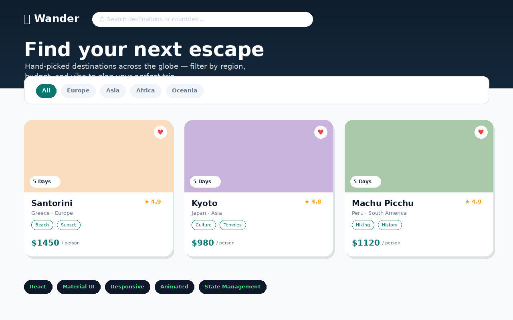

# 🌍 Wander — Travel Destination Explorer

A polished, fully responsive React (Vite) mini-project built with **Material UI (MUI)** for the "React Mini Project — UI Library" assignment. Browse hand-picked destinations, filter by region/budget, sort by rating or price, and save favorites to a wishlist — all wrapped in smooth animations and a clean, modern travel-brand aesthetic.



## ✨ Features

- **Hero section** with fade-in animated headline
- **Live search** — filter destinations by name or country instantly
- **Region & budget filters** (MUI `Chip` + `ToggleButtonGroup`)
- **Sort by rating or price**
- **Reusable `DestinationCard`** — hover lift animation, staggered `Grow` entrance
- **Favorite / Wishlist system** — heart toggle with animated scale, badge counter in navbar
- **Wishlist drawer** (MUI `Drawer`) — view, remove, and jump to saved destinations
- **Destination detail modal** (MUI `Dialog` with slide-up transition) — full description, tags, pricing, booking CTA
- **Fully responsive** — 1 column (mobile) → 2 (tablet) → 3 (desktop) grid
- **Empty state** handling when filters return no results

## 🛠️ Tech Stack

- **React 18** + **Vite**
- **Material UI (MUI v6)** — AppBar, Card, Chip, Dialog, Drawer, ToggleButtonGroup, Grow, Slide, Fade
- **State management** — `useState` + `useMemo` for derived/filtered data across 7 components

## 📂 Project Structure

```
src/
  components/
    Navbar.jsx
    Hero.jsx
    FilterBar.jsx
    DestinationCard.jsx
    DestinationGrid.jsx
    DestinationModal.jsx
    WishlistDrawer.jsx
    Footer.jsx
  data.js        → destination dataset
  theme.js       → custom MUI theme
  App.jsx
  main.jsx
```

## 🚀 Run Locally

```bash
npm install
npm run dev
```

## 📦 Build & Deploy

```bash
npm run build
npm run deploy   # GitHub Pages via gh-pages
```

Also deployable directly to **Netlify** (build command: `npm run build`, publish directory: `dist`).
# 🌍 Wander — Travel Destination Explorer

A polished, fully responsive React (Vite) mini-project built with **Material UI (MUI)** for the "React Mini Project — UI Library" assignment. Browse hand-picked destinations, filter by region/budget, sort by rating or price, and save favorites to a wishlist — all wrapped in smooth animations and a clean, modern travel-brand aesthetic.

🔗 **Live Demo (Vercel):** https://wandernest-reactui.vercel.app/
🔗 **Live Demo (GitHub Pages):** https://ronak861.github.io/WanderNest/
📦 **Repository:** https://github.com/Ronak861/WanderNest


---
Built with 💚 by [Ronak](https://github.com/Ronak861)
